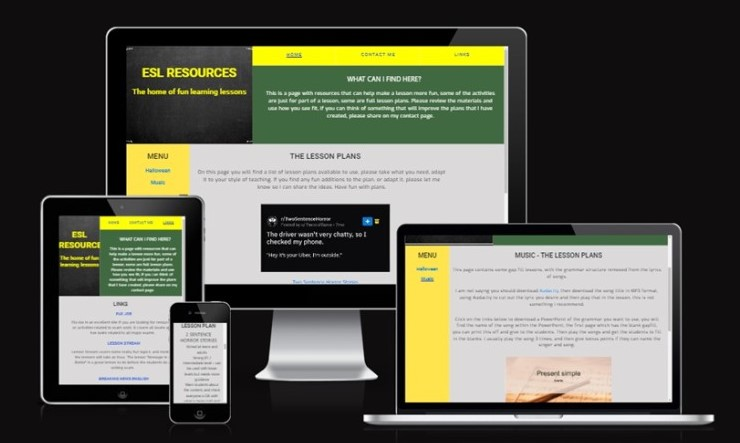
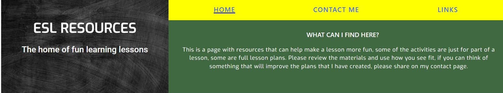
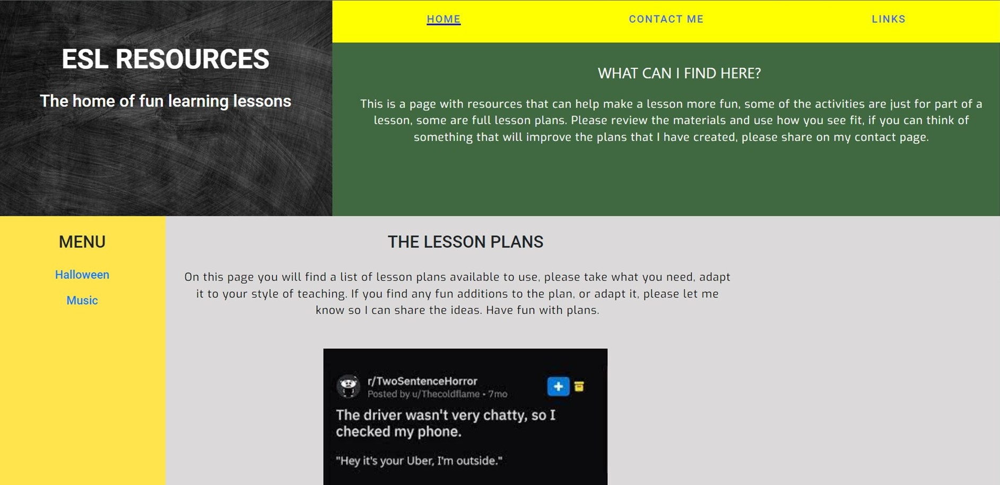
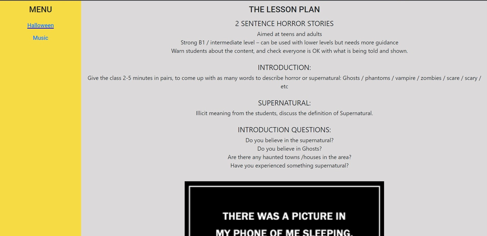
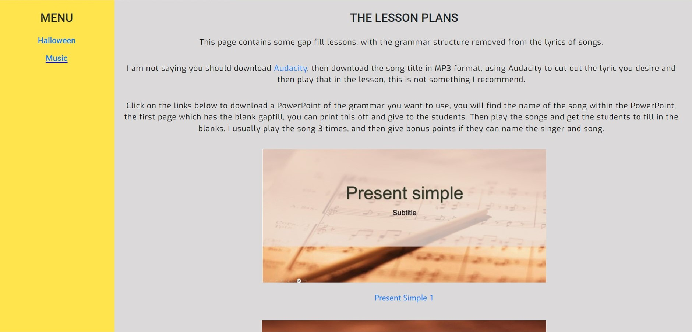
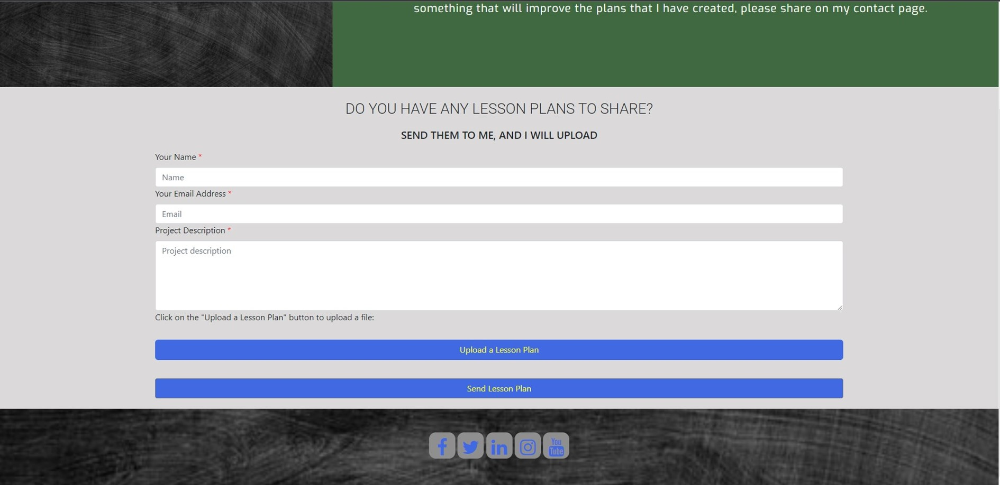
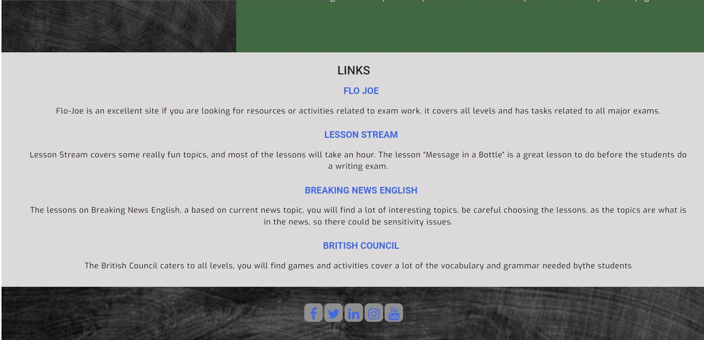

## Menu
- [Menu](#menu)
- [Site Overview](#site-overview)
- [**Planning stage**](#planning-stage)
  - [**Target Audiences:**](#target-audiences)
  - [**User Stories:**](#user-stories)
  - [**Site Aims:**](#site-aims)
  - [**How Is This Will Be Achieved:**](#how-is-this-will-be-achieved)
- [Wireframes](#wireframes)
  - [Home Page](#home-page)
  - [Contact Me](#contact-me)
  - [Lesson](#lesson)
- [Color Scheme](#color-scheme)
- [Wallpaper and Header](#wallpaper-and-header)
- [Features on all Pages](#features-on-all-pages)
  - [Header](#header)
  - [The Navigation bar](#the-navigation-bar)
  - [Footer](#footer)
  - [Fonts](#fonts)
- [Page contents features](#page-contents-features)
  - [Site design](#site-design)
  - [Index page](#index-page)
  - [Halloween Page](#halloween-page)
  - [Music Page](#music-page)
  - [Contact me Page](#contact-me-page)
  - [Links Page](#links-page)
- [Future Enhancements](#future-enhancements)
  - [My expansion plans](#my-expansion-plans)
- [Testing](#testing)
- [Deployment](#deployment)
- [Credits](#credits)
  - [Code Borrowed](#code-borrowed)
  - [General Reference](#general-reference)

## Site Overview

The idea behind this site is share the resources I made when I was an ESL (English as a Second Language) Teacher. I have only used two of the lesson plans I have created in this site, I have chosen two of my favourite lessons for the current form of the site. The main purpose of the site it to share fun activities that will make lessons fun for the teachers and students, my philosophy is that learning should be fun. I have plenty of resources to share, and I hope it helps make learning fun. The lessons on the site are mainly aimed at teenagers and adults, as I specialised in teaching these groups, so they won't be resources for children, there are a lot of websites dedicated to this online.

## **Planning stage**

### **Target Audiences:**

- Teachers searching for lesson ideas
- Teachers looking for ready made lesson plans
- Teachers needing some quick activities

### **User Stories:**

- As a user, I want an easy way to find lesson plans
- As a user, I want a simple site to navigate
- As a user, I want downloadable lesson plans
- As a user, I want a template PowerPoint
- As a user, I want links to resources to this lesson plan
- As a user, I want ideas to make my lessons fun

### **Site Aims:**

- To give teachers resources that will help make their lessons fun
- To give teachers fun full lesson activities
- To give teachers fun part lesson activities

### **How Is This Will Be Achieved:**

- There will be links on the home page to take users to a range of different lesson topics,
- All the lessons will be freely available to all users
- There is a contact me page, which will allow any user to upload ideas, or give feedback on lessons
- The lesson plans will include free downloadable lesson plans and PowerPoint, as well as links to where I found the resources, so they can change from the source.
- I will also include a links page with recommendations to sites that have resources I like to use.
- I want to keep the website simple, as I want the user to find what they need without too much noise on the page, simple layout, with easy to navigate menu bars.

## Wireframes

### Home Page

* [Desktop](/workspaces/ESL-Project/docs/wireframes/desktop-home.jpg)
* [Tablet](/workspaces/ESL-Project/docs/wireframes/home-tablet.jpg)
* [Mobile](/workspaces/ESL-Project/docs/wireframes/phone-home.jpg)

### Contact Me

* [Desktop](/workspaces/ESL-Project/docs/wireframes/desktop-contact.jpg)
* [Tablet](/workspaces/ESL-Project/docs/wireframes/contact-tablet.jpg)
* [Mobile](/workspaces/ESL-Project/docs/wireframes/contact-phone.jpg)

### Lesson

* [Desktop](/workspaces/ESL-Project/docs/wireframes/desktop-lesson.jpg)
* [Tablet](/workspaces/ESL-Project/docs/wireframes/lesson-tablet.jpg)
* [Mobile](/workspaces/ESL-Project/docs/wireframes/phone-lesson.jpg)

## Color Scheme

I have kept the colour scheme similar across all the pages, as I want to use a colour frame that I used when I created lessons and PowerPoints. The background on all text blocks is a light grey as I find this is easier on the eyes, white is sometimes too bright, so I wanted to dull the colour. I have used Blue and Yellow for my menu and links, as they are colours I try to use a lot, as a nod to my favourite football team.

## Wallpaper and Header

On the header and footer I have incorporated a chalk board, to give it a more educational feel, the Halloween lesson page has an eerie forest as it's wallpaper and the music paper, has some notes incorporated into its wallpaper. I like to give the lessons a theme, same with the PowerPoints I create for the lesson.

## Features on all Pages

### Header

  

The header is the same on all pages to make the site uniform, there are some variations - see lesson plans.

There is an English Language logo in the top right on the picture, along side this I have placed a page title "ESL Resources" on a chalk board background.

### The Navigation bar

The navigation bar can be found at the top of the page, I have chosen to use the colours blue and yellow, as it makes the nav bar stand out and it is a colour I use in many of my teaching resources so I want to keep my personal theme involved.

### Footer 

  

The footer is basic, a small note explaining the use of the page, and some social media links, on a chalk board background, again keeping it simple and this is uniformed across all pages on the site.

### Fonts

I set all the fonts across the page to Roboto, I like the font, I find it clear to read, I tested it on: Chrome, Edge and Safari, and it tested fine, I set it with Sans Sarif as back up.

## Page contents features

### Site design

I have a lot of material available from my years of teaching, but decided to only choose two topics because of the limits of my skill, time and to be within the project guide. I have chosen my two favourite lessons to include to show the lay out.

### Index page

  

There is a menu on the left of the page with the different lesson plans, as well as the plans listed in the main section of the page, in the main section I have also added picture links to the lesson pages.

This wasn't the original design, as originally there was an about me section and 2 paragraphs giving some information about about what is on the website.

After a 2am epiphany, I changed the style of the page, I made the what was the original lesson plan page the new index page. I kept some of the text and moved into the heading, I also changed the colour scheme on the page it was more vibrant, but I wanted to make it more subtle, so I toned the colours down. The focus of the site is the lesson plans, so I wanted less distractions on the page.

### Halloween Page

  

This features a layout with two menu bars on the left and right of the centre section, the menu bar on the left, allows the user, to navigate between lessons, to go back to the music lesson, otherwise they would need to go back to the home page and then select 'Music'. The menu on the right, has downloads and links, allowing the user to download the lesson plan and the PowerPoint document. The links go to resources that I used to create the lesson.

The main section of the page, is the lesson plan written out on the page, so a teacher can have a quick review before downloading it. I features a picture in the middle of the page, showing an example of a 'Two Sentence Horror Story'.

### Music Page

  

The Music lesson page has a similar layout to the Halloween lesson page, featuring two menus on the sides of the page, with a centre section. The page features some instructional text at the top of the page, and some links to the PowerPoints below. As this lesson doesn't have a full lesson plan, there isn't one provided, this is a task to be inserted into a lesson, rather than a full lesson plan.  Clicking on the links takes you to a new tab, which contains the downloadable PowerPoint.  

### Contact me Page

  

This is a form, allowing the user to fill in their details and a description to give me some feedback on the lessons. There is an upload button as well as a submit button, to let the user send me a lesson plan or file, which they feel could be shared on my site.

Once the form has been filled in, and the users clicks send lesson plan, it takes the user to a new page to 'Thank them for their submission'. As we haven't done any work on creating a datebase for the forms to go to, I have created a dummy thank you page. In the future I attend to add a database for it.

### Links Page

  

This page has changed names a few times through the project, it has gone between Links and Resources. After some testing by friends, I finally decided to settle on Links, as Resources caused confusion, every user clicked on the resources link, thinking this is where the lesson plans would be be.

This page contains some links to websites that I used a lot during my teaching, and I feel other teachers should know about.

## Future Enhancements

I have lots of plans for this site in the future and I plan on going ahead and expanding on the site, as I stated in the intro, the site is to be used as a resource tool for other ESL Teachers.

### My expansion plans

* I have around 50 PowerPoints on a range of different grammar and vocabulary topics I want to make available on the site. For this to be successful, I will have to include a range of dropdown menus, within the menus, grouping them together.
* There are alternative lessons I have created on the subject of Halloween, including lessons on Zombie survival and Urban Legends aimed at adults and teenagers.
* I have created a lot of lessons, and will have to adapt the menus in the future slightly, adding more sub menus and subpages dedicating to certain topics to fit all my resources on the site.
* The general layout of the site won't change to much, I like the colour scheme, I am a fan of vibrant colours, and I don't want the site to take away from it's ultimate goal of sharing resources.
* If teachers start to send me lesson plans, I also plan to create a directory of resources from other teachers, that will be separate from the resources I create. So I will have to add a fourth button on the menu bar to include this, if my plan works.
* In an ideal world I want to create a sharing resource.

## Testing

I have created a new file called [TESTING.md](TESTING.md) which details the testing process on the site.

## Deployment  

To deploy the site, I used Github, opening the repository for the project - ESL-Project. From there I went to the settings, and then opened up the pages tab, from there I selected the 'deploy from branch' the site took 24 hours to deploy.

## Credits  

[Chalkboard photo](https://pixabay.com/images/search/blackboard/)  
[Music image on homepage](https://charitydigital.org.uk/topics/topics/the-best-platforms-for-copyright-free-music-9577)  
[Two Sentence Horror Story image - main menu](https://www.boredpanda.com/short-scary-two-sentence-horror-stories/?utm_source=google&utm_medium=organic&utm_campaign=organic)  
[Two Sentence Horror Story image - Halloween lesson](https://www.boredpanda.com/short-scary-two-sentence-horror-stories/?utm_source=google&utm_medium=organic&utm_campaign=organic)  
Present Simple picture - Music lesson - This is a screenshot from my PowerPoint  
Present Perfect picture - Music lesson - This is a screenshot from my PowerPoint  

### Code Borrowed

To create the upload button I used W3Schools code - and modified it to fit my design
<label for="file">Upload a Lesson Plan</label> - [w3schools](https://www.w3schools.com/howto/howto_html_file_upload_button.asp)  

To personalise the button I followed the instructions here, modifying the colours and shape to suit my design
[dev.to](https://dev.to/faddalibrahim/how-to-create-a-custom-file-upload-button-using-html-css-and-javascript-1c03)

### General Reference

The project base was influenced by the bootstrap project, designing a resume, I liked the layout of the page, and felt it would work for my idea.  

There were a few resources I used a lot, to help me understand some features I wanted to try, and look at code I could use:
- W3Schools
- Geek to geek
- Stack Overflow
- Dev Community
- Code institute lessons on HTML and CSS
- The Love Running Project from Code Institute

